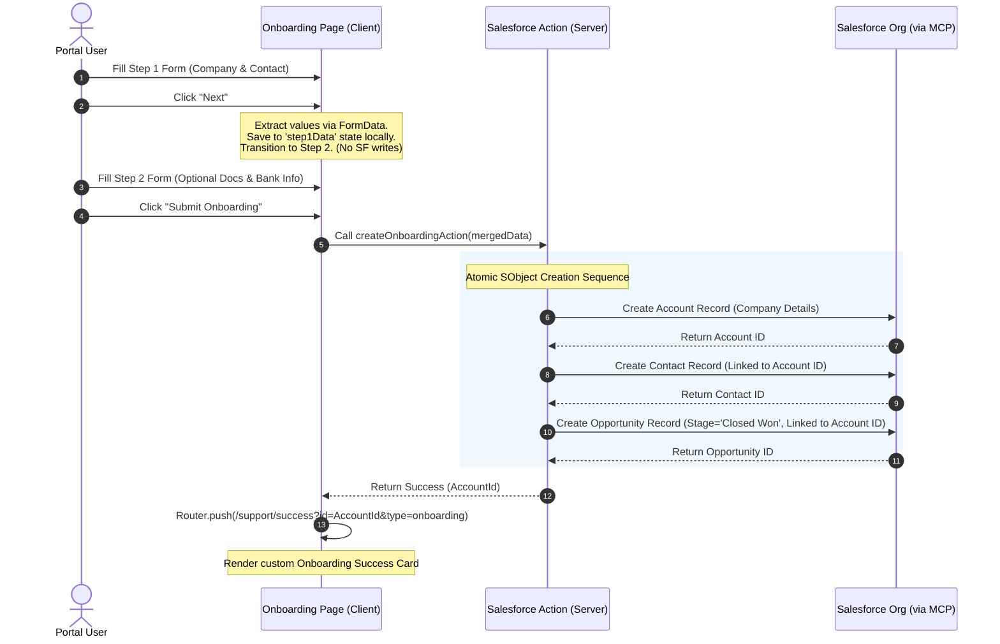

# ABC Equipment Partner Portal - AI Developer & Architecture Guide

Welcome, AI Developer! This document is a comprehensive, production-grade guide to the **ABC Equipment Partner Portal**. It has been designed specifically so that any future AI assistant or human engineer can fully grasp the technical architecture, file-by-file duties, communication mechanics, data flows, routing logic, and third-party integrations with 100% clarity.

---

## 📊 1. Visual Architecture Diagrams

### Onboarding Form & Salesforce Multi-Object Creation Flow
This sequence diagram illustrates how the dynamic 2-step onboarding form handles inputs locally before executing atomic, sequential record creations inside Salesforce at Step 2 final submission.



---

### Dynamic Success Page Routing Flow
The Success Page (`/support/success`) is fully unified. It parses URL query parameters dynamically to present appropriate messaging and progress states.

```mermaid
graph TD
    A[User lands on /support/success] --> B{Check URL searchParams}
    B -->|?type=onboarding| C[Render Onboarding Success State]
    B -->|?type=case| D[Render Support Case Success State]
    B -->|No type parameter| D
    
    subgraph Onboarding State
        C --> C1[Title: "Thank You!"]
        C --> C2[Subtitle: "...onboarding application submitted successfully."]
        C --> C3[Display "Account ID: {id}"]
        C --> C4[Progress Stages: Submitted ➔ Under Review ➔ Onboarded!]
    end

    subgraph Support Case State
        D --> D1[Title: "Thank You!"]
        D --> D2[Subtitle: "...support case submitted successfully."]
        D --> D3[Display "Case ID: {id}"]
        D --> D4[Progress Stages: Case Submitted ➔ Under Review ➔ Issue Resolved]
    end
```

---

## 📁 2. File-by-File Explanations

Here is a detailed, file-by-file map of our codebase outlining exactly what code is written in each file and its specific technical responsibilities:

### 📄 `app/actions/salesforce.ts` (Salesforce Server Actions Connector)
- **What it does:** Coordinates all backend operations with Salesforce. It contains the Server Action `createOnboardingAction(onboardingData)` which receives the fully merged Step 1 & Step 2 form values.
- **Code implementation:** 
  - Connects to the Salesforce Platform Hosted SObject MCP Gateway using the static client name `abc-heavy-equipments` and the connection endpoint `https://api.salesforce.com/platform/mcp/v1/platform/sobject-all`.
  - Atomically creates an **Account** using the company names, addresses, and specialties.
  - Generates a **Contact** containing primary contact names and contact information, explicitly linking it via `AccountId`.
  - Creates an **Opportunity** with `StageName = 'Closed Won'`, `CloseDate = currentDate`, and description details, linked via `AccountId`.
  - Captures, logs, and processes any duplicate rule failures (`DUPLICATES_DETECTED`) or Salesforce platform errors securely, returning clean JSON results to the client.

### 📄 `app/onboarding/page.tsx` (2-Step Dealer Onboarding Page)
- **What it does:** Renders the 2-step Dealer Onboarding interface and implements the form state collection.
- **Code implementation:**
  - Implements a compact, two-column layout grid (`grid-cols-[35%_65%]`) with a custom corporate illustration on the left and form cards on the right.
  - Aligns the horizontal 2-step Progress Stepper perfectly within the right column's width rather than stretching it full-screen.
  - Uses **100% uncontrolled inputs** to eliminate React console warning states.
  - On Step 1 submit, extracts input values using native `new FormData` and stores them in temporary local state (`step1Data`) before moving to Step 2.
  - On Step 2 submit, extracts bank details, merges them with `step1Data`, and dispatches the `createOnboardingAction` server action. If successful, redirects to `/support/success?id=AccountId&type=onboarding`.

### 📄 `app/support/success/page.tsx` (Unified Dynamic Success Page)
- **What it does:** Renders a clean, high-contrast success card that dynamically updates depending on the user's origin (onboarding vs. case creation).
- **Code implementation:**
  - Standard Server Component receiving dynamic URL `searchParams`.
  - Detects if `type === "onboarding"` or `type === "case"`.
  - Dynamically switches subtitles, text references, progress checkmarks, and labels based on the query parameter.
  - Renders a secure, high-contrast Slate & Navy container with complete accessibility and zero white-on-white text readability issues.

### 📄 `app/support/page.tsx` (Raise Support Case Form)
- **What it does:** Renders a compact support case support form that locks perfectly onto standard browser viewports without vertical scrollbars.
- **Code implementation:**
  - Re-compacts the standard Salesforce Case fields.
  - Uses a side-by-side sub-grid layout for the **Case Origin** and **Status** fields, saving significant vertical space.
  - Tightens margins and pads inputs compactly. Replaces large textareas with a compact, 3-row input element to guarantee zero vertical scroll.

### 📄 `app/page.tsx` (Portal Homepage)
- **What it does:** Renders the entry landing page of the ABC Equipment Partner Portal.
- **Code implementation:**
  - Renders the brand hero introduction, equipment product grids, and corporate benefit highlights.
  - Maps all "Register as Partner" buttons and CTA cards directly to the `/onboarding` route.

### 📄 `app/layout.tsx` (Global Wrapper & Header)
- **What it does:** Wraps the entire portal, providing common navigation layouts, standard brand colors, and styling rules.
- **Code implementation:**
  - Implements the global navigation header (ABC Equipment logo, menu items, and "Register" CTAs linked to `/onboarding`).
  - Sets up global HTML head elements, Google Fonts, and standard theme classes.

---

## 🔄 3. How Communication Works Currently

The portal's data flow operates through a secure, high-performance **3-Layer Communication Architecture**:

```text
[ Client Browser (Next.js Client) ]
               │
               │  (Natively dispatches combined Form data)
               ▼
[ Server Actions (Next.js Server / BFF) ]
               │
               │  (Secured MCP Client session: "abc-heavy-equipments")
               ▼
[ Salesforce SObject MCP Gateway ] ➔ [ Live Salesforce Org (SObjects) ]
```

### Layer 1: Client to Next.js Server (BFF)
1. When the user completes Step 2 and submits the form, the browser triggers the `handleSubmit` event handler.
2. The browser gathers all input values natively from the DOM (using `new FormData`), merges Step 1 and Step 2 records, and calls the Next.js Server Action **`createOnboardingAction(mergedData)`** asynchronously.
3. This completely bypasses the need for client-side API keys, credentials, or client-side fetches, keeping all Salesforce tokens and transport layers 100% hidden on the server side (Backend-for-Frontend / BFF pattern).

### Layer 2: Next.js Server to Salesforce Hosted MCP
1. Inside the server action (`salesforce.ts`), the backend processes the request and initiates the MCP connection.
2. The server initializes a secure transport session using the official static gateway:
   `https://api.salesforce.com/platform/mcp/v1/platform/sobject-all`
3. It passes the mandatory Client Name **`abc-heavy-equipments`** inside the payload headers to authenticate and establish a live context.
4. The server sequentially dispatches atomic **`createSobjectRecord`** tool requests for Account, Contact, and Opportunity in a structured transaction loop, passing generated parent IDs to child payloads as required.

### Layer 3: Salesforce MCP to live SObject Records
1. The Salesforce Hosted MCP gateway acts as a secure, low-latency bridge that translates the server's SObject payloads directly into live Salesforce database entries.
2. It executes duplication-matching rules (such as `Standard_Account_Duplicate_Rule`) and returns the successfully created record IDs back to the Next.js server, which are then passed back to the client browser to trigger the success redirect.

---

## 🔒 4. Critical Engineering Guardrails

When modifying, maintaining, or scaling this portal, future AI agents and developers **must** adhere to these absolute rules:

1. **The Client Name Constant:**
   The Salesforce SObject MCP gateway relies on a strict context tied to the client name **`abc-heavy-equipments`**. Changing this name in the connection config will result in an immediate handshake error (`not been initialized`). Keep it static.
2. **Avoid File Input Mandatory Constraints:**
   All document file inputs (Business License, Certificate of Insurance, Tax Residency Certificate) under Step 2 **must remain optional** to allow developers and users to test submissions seamlessly without mandatory file constraints.
3. **Keep Supporting Form Zero-Scroll:**
   The Support Case page (`app/support/page.tsx`) must fit on standard viewports without vertical scrollbars. Keep field gaps compact (`gap-[14px]`), set textareas to exactly `3` rows, and ensure layout items are packed side-by-side using two-column grids.
4. **Follow Brand Guidelines Verbatim:**
   Always use **"ABC Equipment"** instead of "Bobcat". Enforce premium, high-contrast Slate/Orange branding; do not use standard browser-default buttons or generic bright primary colors.

---

*Any future AI assistant can read this guide to safely and efficiently build upon, maintain, or refactor this codebase with 100% safety!*
